<!-- https://capsule-render.vercel.app/api?type=waving&height=300&color=gradient&text=Howdy,%20I%27m%20Andr%C3%A9&animation=fadeIn -->

## 🔍 About me
- 💻 Software developer student at [42 Lisboa](http://www.42lisboa.com)
- ✨ Passionate about learning new technologies
- 📚 Currently learning frontend development with vite and tailwind css
 

## 🌱 Projects

- [libft](https://github.com/andrexandre/libft) [printf](https://github.com/andrexandre/ft_printf) [get_next_line](https://github.com/andrexandre/get_next_line) - Recreation of various standard C library functions
- [so_long](https://github.com/andrexandre/so_long) - Simple 2d game using a library like openGL
- [push_swap](https://github.com/andrexandre/push_swap) - Algorithm for sorting numbers on a stack
- minishell - Simple implementation of a shell that involves pipes, redirections, environment variables and signals
- cub3d - A raycasting-based 3D game engine using a library like openGL
<!-- [minishell](https://github.com/andrexandre/minishell) -->
<!-- [cub3D](https://github.com/andrexandre/cub3D) -->

 

- [cpp-modules](https://github.com/andrexandre/cpp-modules) - 10 little c++ projects about OOP, memory management, templates, STL and advanced C++ features
- ft_irc - IRC server, compatible with the [hexchat](https://hexchat.github.io) client
<!-- [ft_irc](https://github.com/andrexandre/ft_irc) -->

 

- [inception](https://github.com/andrexandre/inception) - Orchestration of a LEMP stack with wordpress using Dockerfiles and docker-compose

## 💻 Tech Stack
### Programming languages

### Tech skills

### Apps and OS's

## 💬 Contact me

#

